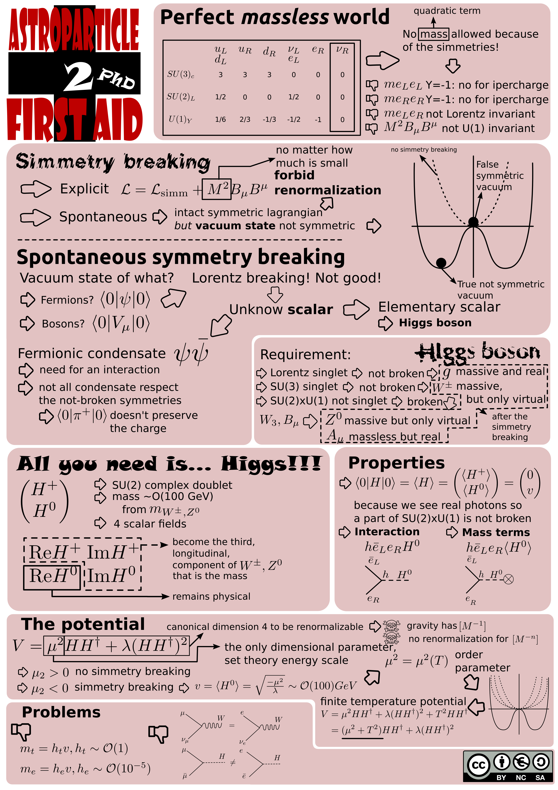

<!-- 
.. link: 
.. description: 
.. tags: astro/physics, astroparticles, Cosmology, infographics, PhD, imported
.. date: 2012-04-23
.. title: Infographics attempts!
.. slug: infographics-attempts
-->

Date: 2012-04-23
Title: Infographics attempts!
Category: Imported
Tags: astro/physics, astroparticles, Computer, Cosmology, infographics, PhD

Recently I am interested in <a href="http://en.wikipedia.org/wiki/Information_graphics" target="_blank" title="Infographics on wikipedia">infographics</a> (check also <a href="http://www.coolinfographics.com/" target="_blank" title="Coolinfographics">this</a>) and if it can help communicating science. There are also two interesting projects related to this, <a href="http://prezi.com/" target="_blank" title="Prezi homepage">Prezi</a> and <a href="http://sozi.baierouge.fr/wiki/en:welcome" target="_blank" title="Sozi homepage">Sozi</a>. I'm not an artist but I want to try to change my way of communicating and to save lectures notes. This is my first attempt, the first lesson of the Astroparticles course for PhD students! It is not really "graphic", but it's my first step!:P 
<!--TEASER_END --> 

