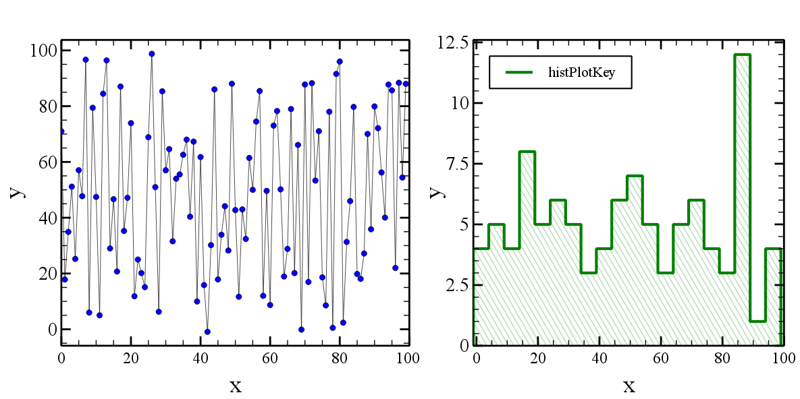

<!-- 
.. title: Python plot examples
.. slug: python-plot-examples
.. date: 2014/09/30 15:07:54
.. tags: 
.. link: 
.. description: 
.. type: text
-->

Two examples on how to make plots with [Veusz](http://home.gna.org/veusz) and 
[Matplotlib](http://matplotlib.org).    
I prefer Veusz because it's easier to configure, modify and it produces 
perfect `pdf` plots, but sometimes Matplotlib it's faster for producing just 
a draft plot to inspect data!

<!-- TEASER_END -->    

````python
#!/usr/bin/env python
# -*- coding: utf8 -*- 

from __future__ import division # no more "zero" integer division bugs!:P
import time
import numpy as np
import veusz.embed as ve

def sm_hist(data, delta=5, n_bin=None, range_=None):
	dataMin = np.floor(data.min())
	dataMax = np.ceil(data.max())
	n_bin = np.ceil(1.*(dataMax-dataMin) / delta)
	range_ = (dataMin, dataMin + n_bin * delta)
	counts, bin_edges = np.histogram(data, n_bin, range_, density = False)
	return counts, bin_edges
	
def sm_hist2(data, delta=5):
	dataMin = np.floor(data.min())
	dataMax = np.ceil(data.max())
	n_bin = np.ceil(1.*(dataMax-dataMin) / delta) + 1
	idxs = ((data  - dataMin) / delta).astype(int)
	counts = np.zeros(n_bin) 
	bin_edges = np.arange(dataMin, dataMax+2, delta)
	for idx in idxs:
		counts[idx] += 1
	counts = np.hstack((np.array([0]), counts, np.array([0])))
	bin_edges = np.hstack((bin_edges[0], bin_edges, bin_edges[-1]))
	return counts, bin_edges

def plotFunc(inpath="./", outpath="./"):
	font = "Times New Roman"
	colors = [u'blue', u'green']
	xmin = ["auto", "auto"]
	xmax = ["auto", "auto"]
	ymin = ["auto", 0]
	ymax = ["auto", "auto"]
	
	xData = np.arange(100) 
	yData = np.random.randint(0, 100, size=100) + np.sin(np.arange(100))
	
	figure = ve.Embedded("Window_1")
	page = figure.Root.Add('page', width = '30cm', height='15cm')
	grid = page.Add('grid', autoadd = False, rows = 1, columns = 2,
						scaleRows=[0.2],
						topMargin='1cm',
						bottomMargin='1cm'
						)
	graphList = []
	
	graphList.append(grid.Add('graph', name="scatter", autoadd=False, 
							hide = False, 
							Border__width = '2pt',
							leftMargin = '0.6cm',
							rightMargin = '0.4cm',
							topMargin = '0.5cm',
							bottomMargin = '1cm',
							))
	
	graphList.append(grid.Add('graph', name="hist", autoadd=False, 
							hide = False, 
							Border__width = '2pt',
							leftMargin = '2cm',
							rightMargin = '0.4cm',
							topMargin = '0.5cm',
							bottomMargin = '1cm',
							))
	
	for i in range(len(graphList)):
		graphList[i].Add('axis', name='x', label = "x",
								min = xmin[i],
								max = xmax[i],
								log = False,
								Label__size = '25pt',
								Label__font = font,
								TickLabels__size = '17pt',
								TickLabels__format = u'Auto',
								MajorTicks__width = '2pt',
								MajorTicks__length = '10pt',
								MinorTicks__width = '1pt',
								MinorTicks__length = '6pt'
							)
		graphList[i].Add('axis', name='y', label = "y", 
								direction = 'vertical',
								min = ymin[i],
								max = ymax[i],
								log = False,
								autoRange = u'+5%',
								Label__size = '25pt',
								Label__font = font,
								TickLabels__size = '20pt',
								TickLabels__format = u'Auto',
								MajorTicks__width = '2pt',
								MajorTicks__length = '10pt',
								MinorTicks__width = '1pt',
								MinorTicks__length = '6pt'
							)
	
	graphList[0].Add('xy', key="scatterPlotKey", name='scatterPlotName',
						marker = u'circle',
						MarkerFill__color = colors[0],
						markerSize = u'3pt', 
						)

	xDataName = "xScatterData"
	yDataName = "yScatterData"
	figure.SetData(xDataName, xData)
	figure.SetData(yDataName, yData)
	graphList[0].scatterPlotName.xData.val = xDataName
	graphList[0].scatterPlotName.yData.val = yDataName
	
	
	counts, bin_edges = sm_hist2(yData, delta=5)
	
	graphList[1].Add('xy', key="histPlotKey", name='histPlotName',
						xData = bin_edges,
						yData = counts,
						marker = 'none',
						PlotLine__steps = u'left',
						PlotLine__color = colors[1],
						PlotLine__style = u"solid",
						PlotLine__width = u'3',
						FillBelow__color = colors[1],
						FillBelow__style = "forward 2",
						FillBelow__hide = False,
						FillBelow__transparency = 70,
						#FillBelow__backtransparency = 50,
						FillBelow__linewidth = '1pt',
						FillBelow__linestyle = 'solid',
						FillBelow__backcolor = "white",
						FillBelow__backhide = True,
						Label__posnHorz = 'right',
						Label__size = '14pt', 
						Label__color = 'black'
						)

	histKey = graphList[1].Add('key', autoadd=False, 
						horzPosn = 'left',
						vertPosn = 'top',
						Text__font = font,
						Text__size = '15',
						Border__width = '1.5pt'
						)
	
	end = raw_input("Press any key to finish...")
	
	figure.Save("example.vsz")
	figure.Export("example.png", backcolor='#ffffff')
	figure.Export("example.pdf")

if __name__ == "__main__":
	inpath = "./"
	outpath = './'
	tt = time.time()
	plotFunc(inpath, outpath)
	print "Done in ", time.time()-tt, " seconds."
````



````python 
#!/usr/bin/env python
# -*- coding: utf8 -*- 

from __future__ import division # no more "zero" integer division bugs!:P
import time
import numpy as np
import matplotlib.pylab as plt
import matplotlib.font_manager as font_manager

# SM like style
params = {'backend': 'png',
		'font.family': "serif",
		'font.size': 25,
		'axes.labelsize': 35,
		#'text.fontsize': 30,
		'legend.fontsize': 30,
		'xtick.labelsize': 28,
		'xtick.major.size': 20.0,
		'xtick.major.width': 3.0,
		'xtick.minor.size': 12.0,
		'xtick.minor.width': 2,
		'ytick.labelsize': 28,
		'ytick.major.size': 20.0,
		'ytick.major.width': 3.0,
		'ytick.minor.size': 12.0,
		'ytick.minor.width': 2,
		#'text.usetex': True,
		'axes.linewidth': 3.0,
		'lines.linewidth': 2,
		'lines.markersize': 15,
		'axes.grid': False,
		'grid': {'color':'gray', 'linestyle':'-', 'linewidth':1},
		'figure.figsize': (10,10),
		'figure.subplot.left': 0.15,  # the left side of the subplots of the figure
		'figure.subplot.right'   : 0.95,    # the right side of the subplots of the figure
		'figure.subplot.bottom'  : 0.12,   # the bottom of the subplots of the figure
		'figure.subplot.top'     : 0.92,    # the top of the subplots of the figure
		'figure.subplot.wspace'  : 0.2,    # the amount of width reserved for blank space between subplots
		'figure.subplot.hspace'  : 0.2,    # the amount of height reserved for white space between subplots
		'figure.figsize': (12, 12)
           }
plt.rcParams.update(params)
	
def sm_hist(data, delta=5, n_bin=None, range_=None):
	dataMin = np.floor(data.min())
	dataMax = np.ceil(data.max())
	n_bin = np.ceil(1.*(dataMax-dataMin) / delta)
	range_ = (dataMin, dataMin + n_bin * delta)
	counts, bin_edges = np.histogram(data, n_bin, range_, density = False)
	# These two lines double the points let you make the histogram
	counts = np.ravel(zip(counts,counts)) 
	bin_edges = np.ravel(zip(bin_edges,bin_edges))
	counts = np.hstack((np.array([0]), counts, np.array([0])))
	return counts, bin_edges
	
	
def sm_hist2(data, delta=5):
	dataMin = np.floor(data.min())
	dataMax = np.ceil(data.max())
	n_bin = np.ceil(1.*(dataMax-dataMin) / delta) + 1
	idxs = ((data  - dataMin) / delta).astype(int)
	counts = np.zeros(n_bin) 
	bin_edges = np.arange(dataMin, dataMax+delta, delta)
	for idx in idxs:
		counts[idx] += 1
	print counts
	# These two lines double the points let you make the histogram
	counts = np.ravel(zip(counts,counts)) 
	bin_edges = np.ravel(zip(bin_edges,bin_edges))
	counts = np.hstack((np.array([0]), counts))
	bin_edges = np.hstack((bin_edges, bin_edges[-1]))
	return counts, bin_edges

def singlePlotScatter(xData, yData, nRows, nCols, x0, y0, rowspan, colspan):
	ax = plt.subplot2grid((nRows,nCols), (x0,y0), rowspan, colspan)
	ax.set_xlabel("x label")
	ax.set_ylabel("y label")
	ax.set_xscale("linear")
	ax.set_yscale("linear")
	ax.set_title("Plot title")
	ax.title.set_y(1.02) # adjust title position
	ax.xaxis.grid(True, which="both")
	ax.yaxis.grid(True, which="major")
	ax.plot(xData, yData, 
			color = "green", 
			markeredgewidth = 0.8, 
			linestyle = '-', 
			linewidth = 2,
			marker = 'o', 
			markersize = 1, 
			label = "label")
	return ax

def singlePlotHist(yData, nRows, nCols, x0, y0, rowspan, colspan):
	ax = plt.subplot2grid((nRows,nCols), (x0,y0), rowspan, colspan)
	ax.set_xlabel("x label")
	ax.set_ylabel("y label")
	ax.set_xscale("linear")
	ax.set_yscale("linear")
	ax.set_title("Plot title")
	ax.title.set_y(1.02) # adjust title position
	ax.xaxis.grid(True, which="both")
	ax.yaxis.grid(True, which="major")
	counts, bin_edges = sm_hist2(yData, delta = 10)
	ax.set_ylim((0, 1.2*counts.max()))
	
	ax.plot(bin_edges, counts, 
				color = "blue",
				alpha = 0.8,
				linewidth = 2,
				antialiased = True,
				zorder = 3 
				)
	ax.fill(bin_edges, counts, 
				alpha = 0.5,
				hatch = "/",
				edgecolor = "blue",
				facecolor = "white",
				antialiased = True, 
				label = "whatever you want"
				)
	ax.legend(loc='upper left', numpoints = 1, prop=font_manager.FontProperties(size=18)).draw_frame(False)

	return ax

if __name__ == "__main__":
	tt = time.time()
	xData = np.arange(100) 
	yData = np.random.randint(0, 100, size=100) + np.sin(np.arange(100))
	
	fig = plt.figure()
	fig.suptitle("Figure title")
	axs = []
	nPlots = 2
	
	axs.append(singlePlotScatter(xData, yData, nRows=1, nCols=2, x0=0, y0=0, rowspan=1, colspan=1))
	axs.append(singlePlotHist(yData, nRows=1, nCols=2, x0=0, y0=1, rowspan=1, colspan=1))
	
	fig.set_size_inches(20, 10)
	plt.savefig("./grid.png", dpi=100)
	plt.close(fig)
	
	print "Done in ", time.time()-tt, " seconds."
````


