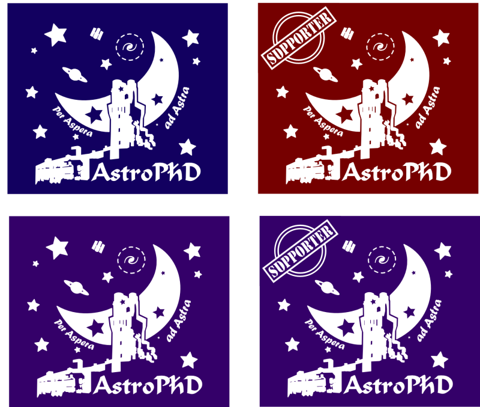
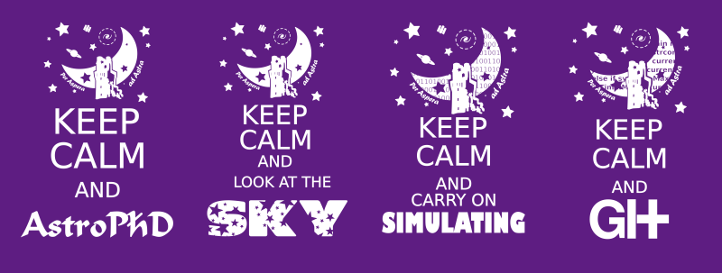

<!-- 
.. link: 
.. description: 
.. tags: 
.. date: 2013/08/22 10:42:45
.. title: AstroFelpa
.. slug: astrofelpa
-->

AstroFelpa is an indipendent initiative with the purpose to represent
the Padua astronomers and all their friends and supporters.    
AstroP(h)D was born within the astronomy PhD students community of Padua but
also covers all the astro-workers of the University and the Observatory.    
The draw tries to bring together most of the fields we are working on:

* "Specola" is our headquarter and out symbol
* The stars all around the picture for all of us working on stellar evolution and both observational
and numerical approaches are included, as anyone working on every kind of star cluster
* The Saturn shape remembers all the (exo-)planets guys
* HST is for all of us working on satellites and technology
* Galactic and extragalactic researchers, cosmologists and darkmatterists have
the galaxy surrounded by a dark matter halo
* The reduced Planck constant is for who is working on spectroscopy and high energy or other 
quantum/relativistic/strange matters

This are the AstroP(h)D and supporters versions for the sweatshirt and the T-shirt.    
    

    
    
Then some new ideas!:P
    
    

 
 
 

<!-- 
 
   
    -->
        
 AstroFelpa by <a xmlns:cc="http://creativecommons.org/ns#" href="brunettoziosi.eu" property="cc:attributionName" rel="cc:attributionURL">BrunettoZiosi</a> is licensed under a <a rel="license" href="http://creativecommons.org/licenses/by-nc-nd/3.0/deed.en_US">Creative Commons Attribution-NonCommercial-NoDerivs 3.0 Unported License</a>. Permissions beyond the scope of this license may be available at <a xmlns:cc="http://creativecommons.org/ns#" href="www.brunettoziosi.eu/stories/research/astrofelpa.html" rel="cc:morePermissions">www.brunettoziosi.eu/stories/research/astrofelpa.html</a>.

