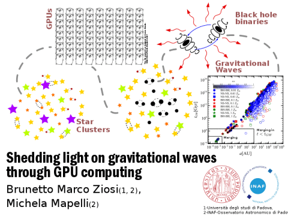

<!-- 
.. link: 
.. description: 
.. tags: 
.. date: 2013/10/31 09:14:34
.. title: PhD
.. slug: phd
-->

## PhD Project

**The impact of stellar evolution and dynamics on the formation of 
compact-object binaries**

<figure>

<!---->

<figcaption>

 Schematic representation of my PhD project.
</figcaption>

</figure>

My PhD project is devoted to improving our knowledge on the demographics 
and the properties of double compact-objects (DCO) binaries, i.e. black hole-black hole (BH-BH), 
neutron star-neutron star (NS-NS) and neutron star-black hole (NS-BH) binaries, inside young dense star clusters.
The goal is to derive accurate predictions for the ground-based Advanced Virgo/LIGO gravitational wave detectors sources.
Gravitational waves (GWs) are among the ``most wanted'' predictions of General 
Relativity: while indirect confirmations of GWs came from observations of pulsar 
binaries, a direct detection of GWs is still missing.
Mergers of binaries 
are among the most promising sources of GWs in the frequency range that will be 
explored by Advanced Virgo and LIGO (~10-10000 Hz). 

My research focus on three main fronts: 

* the impact of dynamics and metallicity on 
the formation and evolution of double compact-object binaries
* the effects 
of a tidal field on the evolution of star clusters and on the
demography of DCO binaries inside them, 
* the changes in the DCO binaries demography 
considering different initial structural properties of the clusters (mass, concentration,
primordial binaries fraction, density, ...).

To investigate the impact of dynamics and metallicity on double compact-object binaries demography, 
I analyzed 600 random realizations of a young dense star cluster at different metallicities. 
I was interested in the binary orbital properties, lifetimes, number of exchanges and coalescence timescales 
(the time a binary need to merge only because of gravitational wave emission).
We chose young and dense star cluster as environment in which to study DCO binaries 
because they are the preferential 
environment for star formation (Lada & Lada, 2003) and gravitational interactions are efficient in exchanging 
energy on short times. 

My results, published in Ziosi et al. (2014), confirm that the cluster dynamics 
favours the formation of BH-BH binaries and were tested against the literature.    

The results I obtained, however, stand on two critical assumptions: 

* I assumed that the 
star cluster would life unpeturbed for 100 Myr but after that time they should be 
dissolved into the galactic disc because of the host galaxy tidal field
* I only simulated random realizations of a single star cluster model.

Both the assumptions can heavily affect estimations on the demography of the DCO binaries 
and the two other parts of my project are devoted to overcome these limitations.    
To face the first issue I implemented in the code
a numerical recipe (the one proposed in Allen & Santillan, 1991) to accurately include the host galaxy gravitational tidal field. 
I am now testing the new tidal field. As soon as it is proved to 
be reliable I will study the effect of the disk component on the life 
of the star clusters and on the DCO binaries dynamics and demography.
In particoular, it is interesting the case in which the cluster is not on a circoular orbit 
coplanar with the galactic disk but on an eccentric and inclined one.
In this case the potential changes rapidly with the time and the effect on the cluster can be 
remarkable (see Madrid et al., 2014).

Regarding the second issue, it is necessary to quantify the effect of initial 
structural properties of the cluster on the double compact-object binaries population.
First of all, cluster structural properties can affect double compact-object binaries demography  
because they influence the dynamical interactions rate among binaries, exchanges included, 
and the cluster surviving time to the tidal field.
Then, analysing a a wide spectrum of different clusters we would be able to 
better calibrate the results on the real population of clusters in our galaxy and 
in the galaxies at distances smaller than the LIGO/Virgo horizon.
To this purpose, I am running tens of simulations spanning a wide range of initial 
structural properties.  All the simulations make havy use of HPC hardware (GPU clusters) and 
I built the necessary computational tools to run, manage and analyze all these simulations.
As soon as the simulations are finished, I will explore the results to understand the behaviour of the different clusters.
This would make us able to highlight which aspects of the star clusters 
are more relevant on the formation and evolution of such binaries and how they impact on them.

## PhD exams and courses 

* Galaxy formation (Dr. Poggianti)
* High energy astrophysics (Prof Franceschini)
* Extrasolar planets (Dr. Claudi)
* Scientific projects management (Dr. Farinato)
* Galaxy Archeology (Prof. Saglia)
* Nucleosynthesis in the early galaxy (Prof. Sneden)
* Collisional dynamics in stellar systems (Dr. Mapelli)
* Supernovae (Dr. Pastorello)
* Astronomia X (Dr. Zampieri)
* Paper writing (Prof. Sneden)
* Gravitional lensing (Dr. Giocoli)

## PhD schools and conferences

* [Perspectives of GPU computing in Physics and Astrophysics](http://www.roma1.infn.it/conference/GPU2014/), Dep. of Physics of Sapienza - Rome, 15-17 Semptember 2014, [Poster](../files/Presentations/2014-ZiosiRomaGPU)
* [Stellar N-body Dynamics](http://www.sexten-cfa.eu/conferences/2014/details/42-stellar-n-body-dynamics), Sport & Kurhotel at Bad Moos - Sexten (Italy), 8-12 September 2014, [Poster](../files/Presentations/2014-ZiosiSestoNBody.pdf)
* [Astro-GR@Rome](http://members.aei.mpg.de/amaro-seoane/astro-gr-rome), Rome - Monteporzio Catone, 14-18 July 2014
* [MODEST 14 - The dance of stars: dense stellar systems from infant to old](http://www.astro.uni-bonn.de/~sambaran/DS2014/), Bad Honnef Physics Center (Germany), 2-6 June 2014, [Poster](../files/Presentations/2014-ZiosiMODEST14.pdf)
* [Dynamics & Kinetic theory of self-gravitating systems Workshop](http://uma.ensta-paristech.fr/conf/gravasco/W2.html) @ [Gravasco IHP trimester "N body gravitational dynamical systems From N=2 to infinity..."](http://uma.ensta-paristech.fr/conf/gravasco/home.html), Paris, 4-8 November 2013
* [Galactic Dynamics Seminar](http://uma.ensta-paristech.fr/conf/gravasco/P3.html) @ [Gravasco IHP trimester "N body gravitational 
dynamical systems From N=2 to infinity..."](http://uma.ensta-paristech.fr/conf/gravasco/home.html), Paris, 21th October-1st November 2013, [Presentation](../files/Presentations/2013-11-08-Gravasco-Ziosi_NO_appendix.pdf)
* Workshop on High Performance Scientific Computing, Strategic Research Project AACSE, 19 Semptember 2013 @ Departement of Information Engineering, Padua
* PhD Summer School on High Performance Scientific Computing, Strategic Research Project AACSE, 16-18 Semptember 2013 @ Departement of Information Engineering, Padua, [Presentation]()
* [INFN School Of Statistics, 3-7 June 2013, Vietri sul Mare (SA)](http://agenda.infn.it/conferenceDisplay.py?confId=5719)
* [School on Gravitational Waves, neutrinos 
and multiwavelenght e.m. observations: the new frontier of Astronomy](http://www.roma1.infn.it/teongrav/VESF/SCHOOL2013_WEBSITE/Vesf_School.html), 10-15 April 2013, Monteporzio Catone (Rome)
* [IMPRS Summer School on Computational Astrophysics](http://www.mpia.de/imprs-hd/SummerSchools/2012/), 10-14 September 2012, Heidelberg, Germany
* [International School of Astrophysics on the Fundamental Cosmic distance scale and the Transient Sky](http://isa2012.oa-teramo.inaf.it/index.php/home), 11-15 June 2012, Teramo, Italy, [Presentation]()
* [Summer School of Parallel Computing](http://www.cineca.it/it/content/summer-school-parallel-computing), 2-13 July 2012 @ CINECA

